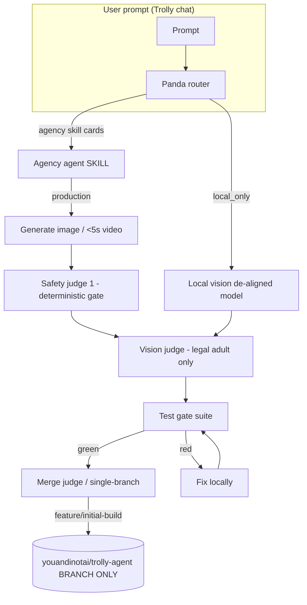

# Pipeline architecture (Trolly)

```mermaid
graph TD
  subgraph In["User prompt (Trolly chat)"]
    U[Prompt] --> P[Panda router]
  end
  P -->|local_only| M[Local vision de-aligned model]
  P -->|agency skill cards| A[Agency agent SKILL]
  A -->|production| G[Generate image / <5s video]
  G --> J1[Safety judge 1 - deterministic gate]
  J1 --> J2[Vision judge - legal adult only]
  M --> J2
  J2 --> TESTS[Test gate suite]
  TESTS -->|green| MERGE[Merge judge / single-branch]
  TESTS -->|red| FIX[Fix locally]
  FIX --> TESTS
  MERGE -->|feature/initial-build| REPO[(youandinotai/trolly-agent BRANCH ONLY)]
```

